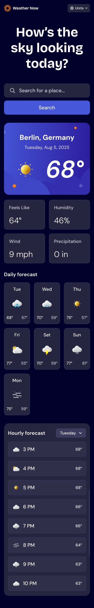

# Weather Information App

Welcome to the Weather Information App — a modern, responsive web application built with **JavaScript**, **HTML**, and **CSS**. This project provides users with a seamless experience for searching, viewing, and interacting with current and forecasted weather data.

---

## 🌦️ Features & Functionalities

- **Search Weather by Location**  
  Enter any location in the search bar to instantly retrieve its weather information.

- **Current Conditions at a Glance**  
  View temperature, intuitive weather icons, and detailed location info.

- **Additional Weather Metrics**  
  See "feels like" temperature, humidity percentage, wind speed, and precipitation amounts for a comprehensive weather snapshot.

- **7-Day Weather Forecast**  
  Browse daily high and low temperatures and weather icons for the week ahead.

- **Hourly Forecast Visualization**  
  Explore how temperatures fluctuate throughout the day, with easy-to-read hourly breakdowns.

- **Dynamic Day Selector**  
  Switch between different days of the week in the hourly forecast to plan ahead.

- **Measurement Units Toggle**  
  Quickly select between Imperial and Metric units using the dropdown.

- **Temperature & Measurement Customization**  
  Choose between Celsius/Fahrenheit for temperature, km/h or mph for wind speed, and millimeters for precipitation.

- **Responsive Layout**  
  Enjoy optimal interface layouts tailored for desktop, tablet, or mobile devices.

- **Accessible Interactivity**  
  All interactive elements feature clear hover and focus states for improved accessibility.

---

## 🖥️ Desktop & 📱 Mobile Design

Below are sample images showcasing both desktop and mobile layouts of the Weather Information App:

### Desktop Design

### Mobile Design

---

## 🚀 Project Link

Visit the live project: **[Weather Information App](your-project-link-goes-here)**

---

## 🛠️ Tech Stack

- **JavaScript** (64.2%)
- **HTML** (22.4%)
- **CSS** (13.4%)

---

Feel free to fork, star, or contribute to this project to enhance its features and usability!

